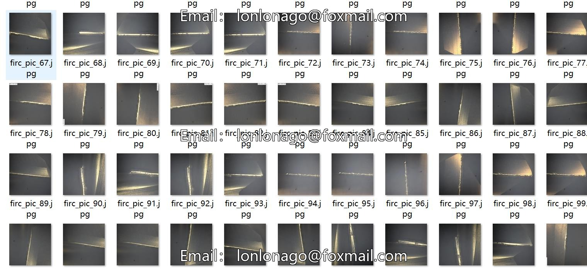
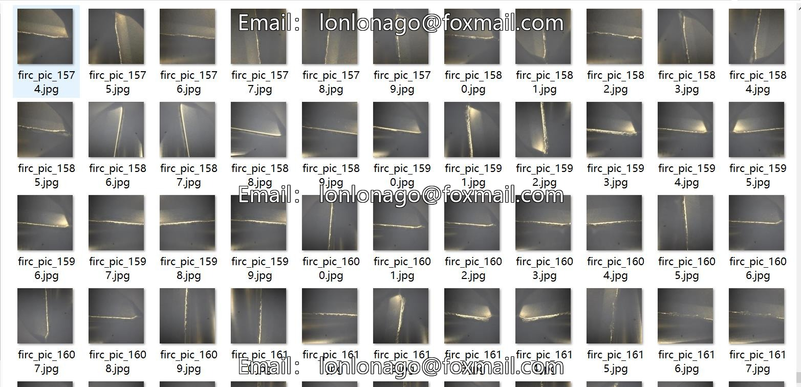
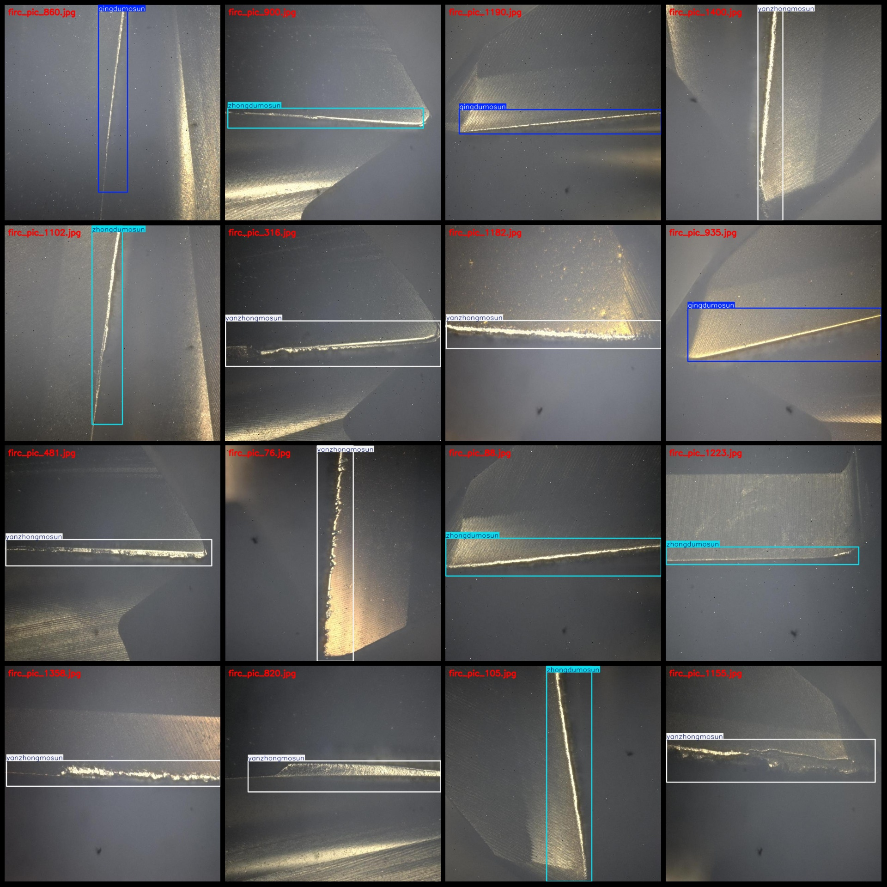
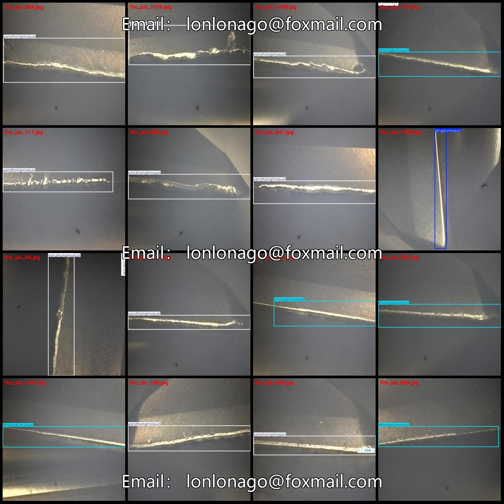

# Dataset of Surface Wear and Damage Detection in Tools: VOC+YOLO Format, 1633 Images, 4 Categories

Please note that approximately 600 images in the dataset are original images, and the remaining are enhanced images. Please refer to the images for specific details.

Dataset format: Pascal VOC format + YOLO format (txt file without split path, only containing jpg images and corresponding VOC format xml files and yolo format txt files).

number of images: 1633
annotation count: 1633
annotation count: 1633
annotationnumber of classes: 4
annotation class names: ["qingdumosun", "qingweimosun", "yanzhongmosun", "zhongdumosun"]
["Mild Wear", "Light Wear", "Serious Wear", "Moderate Wear"]
boxes per class: 
qingdumosun box count = 95
qingweimosun box count = 58
yanzhongmosun box count = 1084
zhongdumosun box count = 416
total boxes: 1653
images per class: 
qingdumosun images = 94
qingweimosun images = 58
yanzhongmosun images = 1074
zhongdumosun images = 407
image resolution: 640x640
Use annotation tool: labelImg
Annotation rule: Draw rectangles around the class
Important notes: The dataset does not have a separate training, validation, and test set; you need to partition it yourself.
Special statement: This dataset does not guarantee any accuracy in the trained models or weight files.
Image preview:
## Images

Here is a pay link on Stripe ( https://buy.stripe.com/3cs8yP7sY87d0vu9AB ). Please contact me lonlonago@foxmail.com after funding $89, and I will send you a complete data files , thank you!

